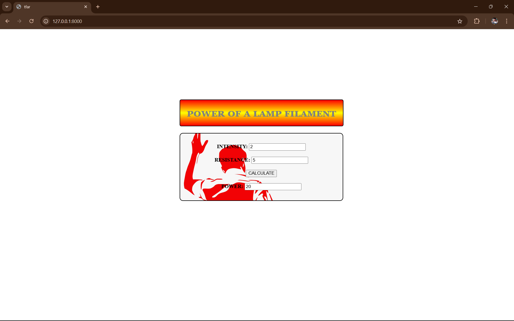

# Ex.05 Design a Website for Server Side Processing
## Date: 22.11.2024

## AIM:
 To design a website to calculate the power of a lamp filament in an incandescent bulb in the server side. 


## FORMULA:
P = I<sup>2</sup>R
<br> P --> Power (in watts)
<br> I --> Intensity
<br> R --> Resistance

## DESIGN STEPS:

### Step 1:
Clone the repository from GitHub.

### Step 2:
Create Django Admin project.

### Step 3:
Create a New App under the Django Admin project.

### Step 4:
Create python programs for views and urls to perform server side processing.

### Step 5:
Create a HTML file to implement form based input and output.

### Step 6:
Publish the website in the given URL.

## PROGRAM :
```

tfar.html

<html>
<head>
    <title>tfar</title>
    <style>
        h1,form{
    border: 2px solid black;
    padding: 20px;
    margin: 10px;
    border-radius: 5px;
}
h1{
    font-size: xx-large;
    font-weight: bolder;
    font-variant: small-caps;
    background: linear-gradient(to bottom,red,yellow,red);
    font-family: Georgia, 'Times New Roman', Times, serif;
    color: grey;
}
form{
    background: linear-gradient(to bottom,red,yellow,red)
}

    </style>
</head>
<body>
    <h1 align="center" > power of a lamp filament</h1>
    <form align="center" method='POST'>
    
     
    <div class="power">

        <label for="INTENSITY">INTENSITY:</label>
        <input type="text" name="INTENSITY" id="INTENSITY" placeholder="Enter the Value" value="{{i}}">
    </div>
    <br>
    <div class="power">
        <label for="RESISTANCE">RESISTANCE:</label>
        <input type="text" name="RESISTANCE" id="RESISTANCE" placeholder="Enter the Value" value="{{r}}">
    </div>
    <br>
    <input type="submit" value="CALCULATE">
    <br>
    <br>
    <div class="power">
        <label for="POWER">POWER:</label>
        <input type="text" name="POWER" id="POWER" placeholder="Answer" value="{{power}}">
        
    </div>
</form>
</body>
</html>

views.py

from django.shortcuts import render
def powerlamp(request): 
    context={} 
    context['power'] = "0" 
    context['i'] = "0" 
    context['r'] = "0" 
    if request.method == 'POST': 
        print("POST method is used")
        i = request.POST.get('intensity','0')
        r = request.POST.get('resistance','0')
        print('request=',request) 
        print('intensity=',i) 
        print('resistance=',r) 
        power = (int(i) ** 2 )* int(r) 
        context['power'] = power 
        context['i'] = i
        context['r'] = r 
        print('Power=',power) 
    return render(request,'thalaforareason/tfar.html',context)

urls.py

from django.contrib import admin 
from django.urls import path 
from thalaforareason import views 
urlpatterns = [ 
    path('admin/', admin.site.urls), 
    path('poweroflamp/',views.powerlamp,name="poweroflamp"),
    path('',views.powerlamp,name="poweroflamproot")
]
```

## SERVER SIDE PROCESSING:


## HOMEPAGE:


## RESULT:
The program for performing server side processing is completed successfully.
